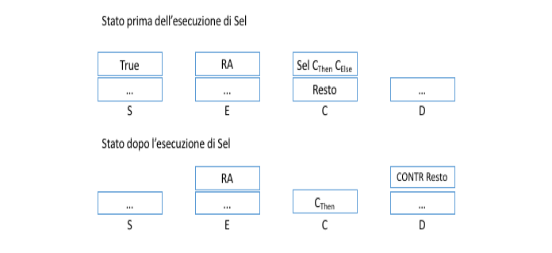
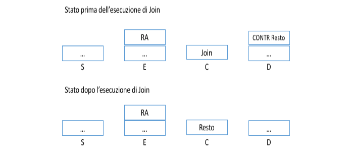
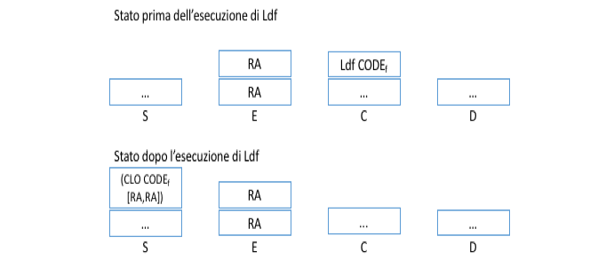
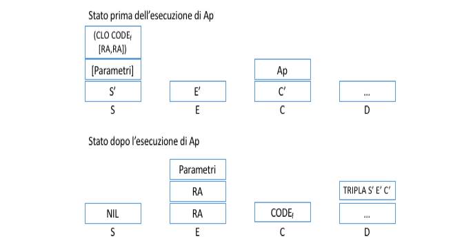
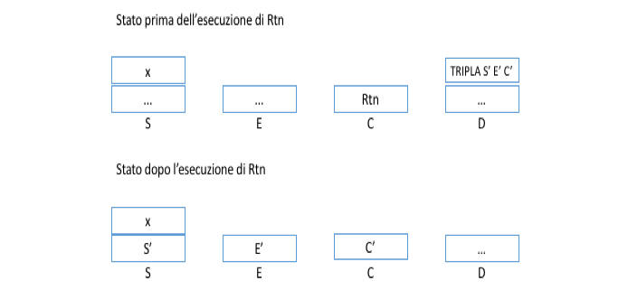

# Parte 1 - Analizzatore lessicale

L'analizzatore lessicale per LispKit funziona come un automa a stati finiti, che parte da uno stato iniziale *I* e considera un carattere della *s* lista di input alla volta.

- Se *s* è uno spazio lo salta
- Se *s* è il dollaro termina l'analisi
- Se *s* è un carattere numerico o ~, passa allo stato *N* il cui scopo è riconoscere un numero. Una volta riconosciuto viene prodotto un token `Number x` e l'automa torna allo stato *i*
- Se *s* è un simbolo, l'automa produce un token che lo descivere
- Se *s* è un simbolo alfabetico allora l'automa passa nello stato *S*, il cui scopo è riconoscere una stringa. Tale stringa può essere un'indetificatore oppure una keyword del linguaggio e lo stato *S* deve essere in grado di discriminare le due situazioni.
- Se *s* è il carattere `\"`, l'automa passa allo stato *SC* per leggere una stringa costante.

Ogni stato *S,SC e N* produce un token consumando parte della stringa in input, per poi ritornare il controllo allo stato *I*.

# Parte 2 - La grammatica del linguaggio

L’analisi sintattica o parsing di una GLC *G* consiste in una programma che riceve in input una stringa *s* e che cerca di costruire un albero di parsing di *G* per la stringa *s*. Se l’albero di parsing esiste, allora *s* appartiene al linguaggio generato da *G*, altrimenti non lo è.

La classe delle grammatiche LL(1) racchiude tutte le grammatiche per le quali è possibile costruire un albero analizzando una sola volta la stringa di input. Ovvero, basta conoscere solamente il primo carattere ancora da leggere per sapere quale produzione utilizzare per continuare nella costruzione dell'albero.

Per verificare che una grammatica sia LL(1) viene utilizzata la **tabella di parsing**: una tabella che ha tante righe quanti sono i non terminali della grammatica e tante colonne quanti sono i terminali della grammatica.
La cella *(X,a)* della tabella contiene la produzione *X::=w* quando *a* appartiene al *First(w)* oppure quando il *First(w)* contiene *epsiolon* e *a* appartiene al *Follow(X)*.

Intuitivamente la produzione è in una determinata cella se la stringa prodotta può iniziare con il non terminale *a*, oppure il non terminale *X* può produrre una stringa vuota e *a* può comparire dopo una produzione di *X*.

Se una cella della tabella di parsing contiene più di una produzione la grammatica non è LL(1).

Una volta definita la tabella di parsing risulta semplice implementare, inquanto è costituito da un insieme di funzioni mutuamente ricorsive, una per ogni non terminale della grammatica (riga della tabella), ognuna delle quali consiste in un grande switch che considera tutti i possibili simboli terminali della stringa di input (colonne della tabella) e per ognuno di essi specifica quale produzione è applicata a quel punto, ovvero quali funzioni del parser devono essere invocate per continuare con l'analisi.

## Calcolo del First

Per ogni produzione di tutti i non terminali *X* della grammatica, si considera il primo termine:
- Se questo è un terminale, viene aggiunto al *First(X)*
- Se questo è un non terminale Y, viene aggiunto il *First(Y)* al *First(X)*. Se *First(Y)* contine 𝝐􏰀, allora è necessario considerare anche il secondo termine della produzione
- Si ripete finché non viene raggiunto un punto fisso

Intuitivamente il first di un non terminale rappresenta l'insieme dei non terminali che possono comparire all'inizio di una produzione del non terminale.

## Calcolo del Follow

Per ogni non terminale *X* e per ogni produzione della grammatica *Y::= w<sub>1</sub>Xw<sub>2</sub>*:

- Si aggiunge *First(w<sub>2</sub>)* al *Follow<sub>i</sub>(X)*, tranne 𝝐.
- Se 𝝐 appartiene al *First(w<sub>2</sub>)*, allora si aggiunge *Follow<sub>i-1</sub>(Y)* al *Follow<sub>i</sub>(X)*.
- Si ripete finché non viene raggiunto un punto fisso.

Intuitivamente il *Follow* di un non terminale è l'insieme dei simboli terminali che possono comparire dopo una produzione del non terminale.

## Conversione della grammatica a LL(1)

La grammatica originale di LispKit non è LL(1):

```
1 Prog ::= let Bind in Exp end | letrec Bind in Exp end
2 Bind ::= var = Exp X
3 X ::= and Bind | epsilon
4 Exp ::= Prog | lambda(Seq_Var) Exp | ExpA | OPP(Seq_Exp) | if Exp then Exp else Exp
5 ExpA ::= T E1
6 E1 ::= OPA T E1 | epsilon
7 T ::= F T1
8 T1 ::= OPM F T1 | epsilon
9 F ::= var Y | exp_const | (ExpA)
10 Y ::= (Seq_Exp) | epsilon
11 OPA ::= + | ­-
12 OPM ::= * | /
13 OPP ::= cons | car | cdr | eq | leq | atom
14 Seq_Exp ::= Exp Seq_Exp | epsilon
15 Seq_Var ::= var Seq_Var | epsilon
```

Come si può notare nella tabella di parsing (`grammatica-ll1.pdf`), la cella *(Y, '(')* contiene due produzioni: *10.1* e *10.2*.

La produzione *10.1* è presente perché *'('* appartiene al *First(Y)*, mentre *10.2* può essere scelta perché *First(Y)* contiene 𝝐 e *'('* è presente nel *Follow(Y)*.
  
Per risolvere l'ambiguità si può rimuovere *'('* dal *Follow(Y)*.

Ripercorrendo i passi dell'algoritmo che calcola il *Follow(Y)*, si trova che il terminale *'('* è presente a causa del *Follow(Exp)*, il quale lo continene perché è presente nel *First(Seq_Exp)* per la produzione *14.1 Seq_Exp ::= Exp Seq_Exp*.

Se ci fosse un non terminale tra *Exp* e *Seq_Exp*, il *Follow(Exp)* andrebbe a contenere quel non terminale al posto del *First(Seq_Exp)*, ovvero sarebbe risolta l'ambiguità dal momento che *'('* non si troverebbe più nel *Follow(Exp)* e nel *Follow(Y)*.

Una possibile modifica che risolve questa ambiguità è *14.1 Seq_Exp ::= Exp , Seq_Exp*.

Così facendo le produzioni di *Seq_Exp* diventano *Exp , Exp , Exp , 𝝐* mentre nella versione ambigua erano *Exp Exp Exp 𝝐*.

Per evitare di avere la *','* finale si può modificare ulteriormente la grammatica con: *14.1 Seq_Exp ::= Exp Exp_Sep* e aggiungendo *16 Exp_Sep ::= , Exp Exp_Sep | 𝝐*.

La nuova grammatica diventa quindi:

```
1 Prog ::= let Bind in Exp end | letrec Bind in Exp end
2 Bind ::= var = Exp X
3 X ::= and Bind | epsilon
4 Exp ::= Prog | lambda(Seq_Var) Exp | ExpA | OPP(Seq_Exp) | if Exp then Exp else Exp
5 ExpA ::= T E1
6 E1 ::= OPA T E1 | epsilon
7 T ::= F T1
8 T1 ::= OPM F T1 | epsilon
9 F ::= var Y | exp_const | (ExpA)
10 Y ::= (Seq_Exp) | epsilon
11 OPA ::= + | ­
12 OPM ::= * | /
13 OPP ::= cons | car | cdr | eq | leq | atom
14 Seq_Exp ::= Exp Exp_Sep| epsilon
15 Seq_Var ::= var Seq_Var | epsilon
16 Exp_Sep  ::= , Exp Exp_Sep | 𝝐
```

e come si può vedere dalla seconda tabella di parsing (`grammatica-ll1.pdf`) la grammatica risulta essere LL(1).

# Parte 3 - Parsing

A questo punto si ha a disposizione una lista di `Token` che rappresenta il programma ricevuto in input e una serie di regole che definiscono la grammatica del linguaggio.

L'obiettivo di questa parte è quello di riuscire ad attraversare tutta la lista di token, utilizzando delle funzioni che implementano le varie produzioni della grammatica, senza trovare errori.

L'analisi di una sequenza di token parte quindi dal riconoscimento della produzione iniziale della grammatica: `Prog​ ::= let Bind in Exp end` oppure `Prog​ ::= letrec Bind in Exp end`.
L'implementazione della funzione riconosce questa produzione è la seguente:

```haskell
prog :: [Token] -> Exc [Token]
prog token_list = do
          x <- rec_key token_list -- cerca il token LET o LETREC
          y <- bind x             -- cerca una produzione di Bind
          z <- rec_in y           -- cerca il token IN
          w <- exp z              -- carca una produzione di Exp
          rec_end w               -- cerca il token END
```

Le funzioni `rec_key`, `rec_in` e `rec_end` consumano il primo token della lista ricevuta come parametro e controllano se corrisponde con quello atteso e nel caso non ci sia questa corrispondenza sollevano un errore utilizzando le monadi.

Le funzioni `bind` e `exp` si occupano di riconoscere una produzione dei non-terminali `Bind` e `Exp`.

Per gestire gli errori di parsing, ovvero quando la sequenza di token non corrisponde ad una produzione della grammatica, viene utilizzata la **monade** `Exc`:

```haskell
data Exc a = Raise Exception | Return a
type Exception = String

instance Functor Exc where
  fmap f (Raise e) = Raise e 
  fmap f (Return v) = Return (f v)

instance Applicative Exc where  
    pure = Return  
    (Raise e) <*> _ = Raise e
    (Return f) <*> something = fmap f something

instance Monad Exc where
 return x  = Return x
 (Raise e) >>= q   = Raise e
 (Return x) >>= q  = q x 
```

In particolare, se una delle funzioni di parsing trova un token inaspettato, ritorna una monade `Raise ERROR_MSG` e la catena di invocazioni continua normalmente, con la differenza che quando viene applicata la funzione `>>=` il risultato è sempre `Raise ERROR_MSG`, il quale viene propagato fino alla fine della catena di invocazioni, per poi essere stampato.

Ogni funzione in cui compare il simbolo `do ... <- ` consiste in una sequenza di invocazioni di funzioni del tipo `a -> m b` attraverso la funzione `>>=` delle monadi. 
Pertanto eseguire:

```haskell
do
  x <- rec_key token_list 
  y <- bind x             
  z <- rec_in y           
  w <- exp z              
  rec_end w  
```

equivale a scrivere:

```haskell
(((((rec_key token_list) >>= bind) >>= rec_in) >>= exp) >>= rec_end
```

con la differenza che la prima notazione risulta molto più leggibile.

# Parte 4 - Albero astratto

Il parse della parte 3 analizza la lista di token e costruisce l'albero sintattico per verificarne la correttezza.
Una volta costurito però, l'albero viene dimenticato.

Questo è uno spreco, perché l'albero sinttattico rappresenta la struttura del programma e averlo a disposizione rende più semplice la compilazione.

Conviene quindi modificare il parse in modo che, durante il parsing, tenga in memoria l'albero prodotto.

Per far ciò è necessario modificare le funzioni che implementano il parser in modo che abbiano come tipo di ritorno la tupla `([Token], LKC)`, dove `LKC` è un datatype che definisce l'albero sintanttico del linguaggio LispKit.

Questa tecnica prende il nome di tecnica deli **attributi semantici** e consiste nell'aggiungere attributi e regole sematniche alla grammatica usata per il parsing, dove qusti atttributi sono parametri o valori di ritorno delle funzioni che compongono il parser.

Gli attributi possono essere **sintetizzati**, ovvero calcolati come risultato di una funzione di parsing, oppure **ereditati**, ovvero forniti come parametro ad una funzione di parsing.

Un'esempio di attributo sintetizzato è dato da **Trad**, questo attributo di una produzione specifica come questa viene tradotta in `LKC`.

Le funzioni del parser devono quindi essere modificate in modo che riescano ad definire l'attributo Trad per la produzione che rappresentino e che lo ritornino.

Ad esempio la funzione `prog` utilizza le funzioni `bind` e `exp` per ottenere le traduzioni dei due non terminali e poi le aggrega in modo da ottenere la traduzione del non terminale `Prog`, secondo la regola semantica che definisce la traduzione.

```haskell
prog :: [Token] -> Exc ([Token], LKC)
prog token_list = do
          (x, tipo_let) <- rec_key token_list 
          (y, trad_bind) <- bind x 
          z <- rec_in y
          (w, trad_exp) <- exp z 
          k <- rec_end w
          Return (k, if (tipo_let == "LET") then LETC trad_exp trad_bind
                                            else LETRECC trad_exp trad_bind)
```

L'attributo Trad di un programma LispKit viene quindi costruito con un approccio bottom-up.

Nella grammatica sono presenti anche delle produzioni, la cui regola semantica per ottenere la traduzione richiede le informazioni riguardanti la traduzione di produzioni precedenti.

Tali produzioni devono quindi avere anche un attributo ereditato, in modo da riuscire a recuperare la traduzione necessaria.

Un esempio di questo caso sono le produzioni legate alle espressioni algebriche come *5.1 ExpA ::= T E1* e *6.1 E1::= OPA T E1*.

In questo caso per ottenere l'attributo Trad di *6.1* è necessario avere a disposizione la traduzione del non terminale *T* della produzione *5.1*.
Questo perché, per come è definita l'operazione di somma e sottrazione in `LKC` è `ADD LKC(primo termine) LKC(secondo termine)` e l'albero `LKC` del primo termine coincide con l'attributo Trad del non terminale *T* di *5.1*.

La produzione *6.1* necessita quindi di un attributo ereditato, che prende il nome di **Op**, con il quale la funzione di parsing per *5.1* le fornisce l'attributo Trad di *T*.

Nel lato pratico, tutto ciò si riduce ad aggiungere un nuovo parametro `po` alla funzione che esegue il parsing di *E1*:

```haskell
expa a = do
           (x, trad_t) <- funt a -- calcola Trad(T)
           fune1 x trad_t  -- passa l'attributo Po(E1)

fune1 ((Symbol PLUS):b) po = do
                            (x, trad_t)  <- funt b
                            (y, trad_e1) <- fune1 x trad_t
                            Return (y, ADD po trad_e1) -- calcola Trad(E1) utilizzando anche Po(E1).
``` 

Questo approccio funziona per questa grammatica perché le dipendenze degli attributi semantici segunono lo stesso ordine con il quale il parser percorre l'albero sintattico.


# Parte 5 - Compilazione

La macchina SECD che interpreta il LispKit è composta da 4 componenti:

- **S**: una pila contenente i risultati parziali e finali dei calcoli. Quando viene eseguita un'operazione, gli operandi vegono recuperati dalla cima della pila e una volta che il calcolo è completato, il risultato viene posto in cima alla pila.
- **E**: l'ambiente dinamico che contiene gli R-valori delle variabili del programma in esecuzione.
    L'ambiente è organizzato come una pila di blocchi, che vengono creati ogni volta che viene eseguita una `let` o `letrec`. Ognuno di questi blocchi corrisponde ad un record di attivazione.
    Il tutto viene rappresentato come una lista di liste, con le liste interne che rappresentano un singolo blocco.
    L'indirizzo delle variabili viene espresso come una tupla *(n1,n2)* dove *n1* indica il blocco a partire dalla cima dello stack (il primo RA ha *n1=0*) e *n2* indica l'offset interno al record di attivazione.
- **C**: una lista di istruzioni da eseguire
- **D**: una lista utilizzata per mantere lo stato della macchina quando viene invocata una funzione o viene eseguita un'operazione condizionale. 

Le istruzione che la macchina riesce ad interpretare sono rappresentate dal datatype `Secdexpr`, tra queste degne di nota ci sono:

- `Add` e altre operazioni aritmetiche o su liste: si tratta di operazione 0-arie che non ricevano parametri, dal momento che utilizzano i dati in cima alla pila **S**. **Per eseguire la somma x+y, è necessario eseguire l'istruzione `Add` con *x* in cima alla pila e *y* subito sotto**
- `Ld (Interger, Integer)`: carica il valore di una variabile in cima alla pila **S**, la coppia ricevuta come parametro rappresenta l'indirizzo della variabile rispetto l'ambiente dinamico **E**.
- `Ldc LKC`: carica in cima alla pila il valore costante ricevuto come parametro.
- `Sel [Secdexpr] [Secdexpr]`: istruzione di salto condizionale, viene valutato il valore booleano che si trova in cima alla pila, in base al suo valore di verità viene eseguito uno dei due blocchi di codice. Entrambi questi blocchi devono terminare con un'istruzione `Join`.
L'esecuzione dell'istruzione `Sel` porta il seguente cambiamento di stato della macchina:

- `Join`: istruzione che ripristina il codice del programma dopo l'esecuzione di blocco condizionale. L'effetto che ha sulla macchina è il seguente:

- `Ldf [Secdexpr]`: istruzione che crea la chiusura della funzione che ha come corpo il codice passato come parametro. L'esecuzione di questa istruzione crea una copia dell'ambiente dinamico corrente che deve essere caricata quando viene eseguita la funzione, in modo da ottenere il **binding statico**. L'effetto dell'istruzione sulla macchina è il seguente: 

- `Ap`: istruzione che invoca la funzione, la cui chiusura si trova in cima allo stack. L'esecuzione dell'istruzione crea una copia dello stato corrente nel Dump e carica l'ambiente presente all'interno della chiusura:

- `Rnt`: istruzione che esegue il return al termine dell'esecuzione di una funzione. Recupera dal Dump lo stato dell'interprete prima dell'esecuzione ed inserisce in cima allo stack il valore ritornato dalla funzione: 
- `Push`: aggiunge in cima all'ambiente dinamico un record farlocco, denominato `[OGA]`
- `Rap`: istruzione che esegue l'invocazione di una funzione ricorsiva (approfondita più avanti).

Una volta capito come funziona la macchina SECD, compilare le istruzione `LKC` in `Secdexpr` risulta semplice.

Il compilatore per calcolare gli indirizzi delle variabili non utilizza l'ambiente dinamico dell'interprete, ma utilizza la versione statica che al posto dei valori contiene i nomi. 
L'ambiente statico viene rappresentato con la lettera **n**.


Degni di nota sono la compilazione di `LETC` e `LETREC`.

In particolare per `LETC` è necessario produrre sia il codice per calcolare la parte destra dei binders e per mettere la lista risultatante in cima allo stack, sia il codice per la parte *in* del blocco.

Il codice prodotto risulta essere:

```
[Codice per il calcolo dei binders][Ldf ([Codice per il corpo della funzione])][Ap][...]
```

Da notare che qunado viene compilato il codice del corpo della funzione con `comp_body = comp x (v:n) [Rtn]`, il primo record dell'ambiente statico è quello con il nome dei binders (`v`). Mentre quando viene compilata la lista dei parametri non è presente il record dei binders, questo perché dentro una `let` non possono esserci binders ricorsivi.

La compilazione di `LETRECC` risulta più complessa, perché le espressioni dei binders possono essere ricorsive. Ad esempio:

```
letrec 
    FACT = lambda (X) if eq(X,0) then 1 else X*FACT(X-1) and 
    a = 2
in 
    FACT(a)+2 
end $
```

Per questo motivo è necessario che, anche quando viene compilato il codice per il calcolo dei valori dei binders, ci sia il record con il nome dei binders in cima all'ambiente statico:

```haskell
complist e (v:n) ({- resto del codice-})
```

Così facendo il compilatore riesce a calcolare correttamente gli indirizzi anche per i binders che compaiono all'interno di altri binders. Come la funzione `FACT` che compare sia a sinistra dei binders che a destra.

C'è però un problema, quando l'ambiente dinamico esegue il codice che calcola i binders, non ha in cima all'ambiente dinamico il record `v` che c'è nell'ambiente statico del compilatore e la mancanza di questo record sballa gli indirizzi calcolati dal compilatore.

Perciò il compilatore, prima del codice per il calcolo dei binders inserisce l'istruzione `Push` che mette in cima all'ambiente dinamico il record `OGA`. Così facendo gli indirizzi calcolati a compile time coincidono con quelli effettivi a runtime.

Quando viene eseguita l'espressione `in` di un `LETRECC`, è necessario andare a sostituire il record `OGA` con un record contenente i valori dei binders.

Per specificare all'interprete che deve eseguire delle operazioni in più, viene utilizzata l'istruzione `Rap` al posto di `Ap`.

Quando l'interprete deve eseguire `Rap`, va a rimuovere il record `OGA` e lo sostituisce con un record di attivazione che contiene i valori calcolati per i binders.

Ci sono però ancora problemi perché se il nuovo record aggiunto contiene delle chiusure, quando queste sono state compilate utilizzando un ambiente statico con in cima il record `v` contenente i nomi dei binders definiti dentro il blocco `letrec`.

Viene quindi eseguita la funzione `lazyE` che scorre il record con i valori dei binders ed invoca su ogni valore la funzione `lazyClo`, la quale quando incotra una chiusura, aggiunge in cima all'ambiente dinamico della chiusura il record con i valori dei binders.

Grazie all'approccio lazy di haskell risulta semplice applicare queste funzioni, dal momento che vengono effettuate delle ricorsinioni infinite.

Altra cosa da notare è che negli ambienti salvati dentro le chiusure non è necessario andare ad aggiungere il record `OGA`, perché queste funzioni non possono essere invocate prima dell'esecuzione dell'istruzione `Rap`.

Questo deriva dal fatto che per semplicità, l'interprete non riesce a gestire programmi del tipo:

```
letrec 
    x = 2 + 3 and
    z = x + 2 
in 
    x+z 
end $
```

